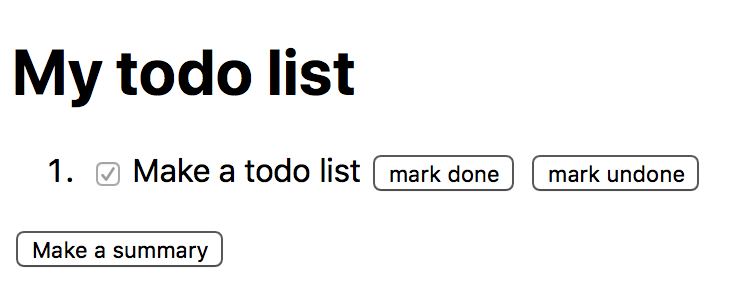
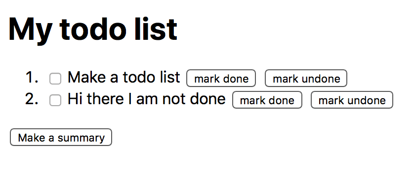

# Make a todo list

## Setup

Clone the gist:

```sh
git clone https://gist.github.com/0c37891fa9bd96bb67534fbb081418de.git
```

Make a new html page with a nice header and an empty list of todo-items in the "solution" folder.

Add the first todo item. A to-do item consists of a `span` with text in it (the name of the todo), a button that says "mark done" and another button that says "mark undone" and finally a (disabled) check mark that's not yet checked. The text in this first item will be "make a todo list". This now looks like:


Finally there's also a button underneath the list to make a summary of which todos are done:


Finally let's add the system fonts to our page: `-apple-system, BlinkMacSystemFont, sans-serif`

## Marking items as done

If a user presses on the "mark as done" button, you should toggle the checked-ness of the checkbox. If you click done, it should look like this:



## Adding a second item

There's also a second todo item with the text "hi there I am not done", which is added just like the first item. If you click this "mark done" button it should also work



They should both be able to be marked as done:


## listing done items

When we press the "Make a summary" button, let's make a new list of all the done items underneath it, with a `<p>` tag before it with the text "done items". Then in that list we will put all the items that are currently done's text.

We do this by fist clearing the list's DOM completely, then adding all the texts we need to add. This shoudl work like this:


## Marking items as undone

Next we want to be able to mark an item as undone, or not done. We need to react to the click to the undo button; and make the item not checked anymore. This should function like this:


## adding a new item

Next, we want to add an input before the summary button to be able to add an element to the todo list. Make sure all the buttons work!


## toggling done-ness

## Automatic everything!!8!!8!!!
